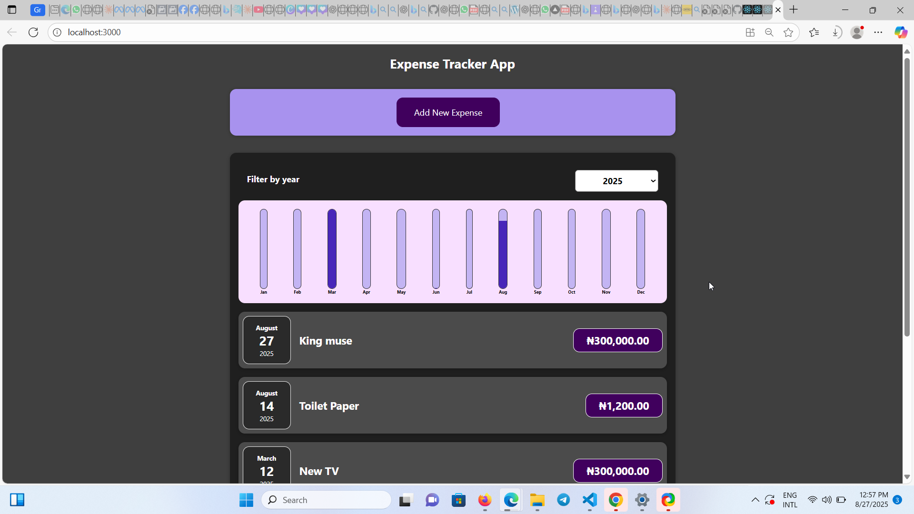

# 💰 Expense Tracker App (React.js)

A simple and responsive **Expense Tracker** built with **React.js** that helps you track your expenses, view a summary of spending, and manage your budget efficiently.

---

## 📸 Screenshots
(Add screenshots of your app UI here)


---

## 🚀 Features
✅ Add new expenses with title, amount, and date  
✅ View all expenses in a list format  
✅ Display total amount of expenses dynamically  
✅ Format amounts in Nigerian Naira (₦)  
✅ Clean and responsive UI  

---

## 🛠️ Technologies Used
- **React.js** (useState, props)
- **CSS** for styling
- **JavaScript (ES6+)**

---

## 🔧 Installation & Setup
1. Clone this repository:
   ```bash
   git clone https://github.com/yourusername/expense-tracker.git
